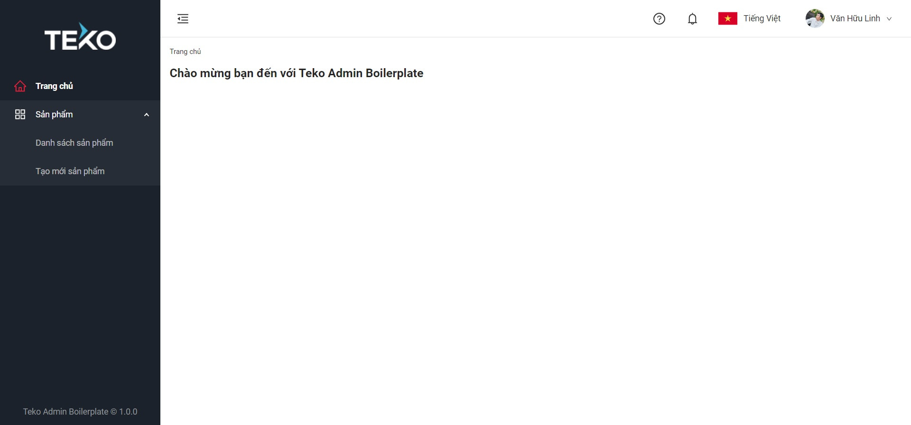

# Teko Admin Boilerplate

Teko Admin Boilerplate is an admin template for staff/back-office using in [Teko](https://teko.vn/).

This boilerplate was bootstrapped with [React](https://reactjs.org/), using [Create React App](https://github.com/facebook/create-react-app).



## Features/packages included

- [TypeScript](https://www.typescriptlang.org/) - Type checker.
- [Ant Design](https://ant.design/components/overview/) - Build layout & components.
- [axios](https://github.com/axios/axios) - Promise based HTTP client.
- [tekoid-js](https://git.teko.vn/user-profile/iam/tekoid-js) - Authentication & authorization. The boilerplate allows you to grant permissions on menus/routes (see [routes](#routes) section for more information).
- [react-i18next](https://github.com/i18next/react-i18next) - Multi-language support (see [locales](#locales) section for usage).
- [tracker-js](https://git.teko.vn/_data/tracking/tracker-js) - Track page view and other events.
- [ESLint](https://eslint.org/) and [Prettier](https://prettier.io/) - Coding convention.
- [Storybook](https://storybook.js.org/) - UI explorer for components.
- [darkreader](https://github.com/darkreader/darkreader) - Dark mode support.

> Note: You can install more packages which are familiar to you (eg: redux, moment, lodash...) and implement features as you want.

## Installation

Use the package manager [npm](https://www.npmjs.com/) or [yarn](https://www.npmjs.com/package/yarn) to install Teko Admin Boilerplate.

```
yarn install
```

Run the app in the development mode. Open [http://localhost:3000](http://localhost:3000) to view it in the browser.

```
yarn start
```

## Configuration

### Environment variables

> Note: The boilerplate uses the file `public/env.js` as default env file for convenient CI/CD setup. You can still use the default `.env` file of [Create React App](https://create-react-app.dev/docs/adding-custom-environment-variables).

- To customize environment variables, override values from `public/env.js` to `public/configs/env-local.js` (create this file if it doesn't exist). Don't forget to uncomment the line `<script src="/configs/env-local.js"></script>` in `public/index.html`.
- Use your IAM Client ID by changing the value of `iam.clientId` with your ID (or you can still use the default value for testing).
- To enable tracking, replace the value of `tracker.appId` in `public/configs/env-local.js` with your [tracker-js](https://git.teko.vn/_data/tracking/tracker-js) App ID.

### App configuration

- Change the app logo by replacing `src/assets/logo.png` with your logo.
- Change the meta data, favicon... according to your app in `public/index.html`.
- Config IAM scopes in `common` constant (see [constants](#constants) section), define permissions for menus/routes with the format **app:resource:action** in `app`, `resource` and `action` constants. The boilerplate has the default config for **catalog** service, you can customize to your own services.
- The default theme of application was customized using [craco](https://github.com/gsoft-inc/craco) with LESS variables configured in `src/craco.config.js`. You can change these variables to match your own theme.
- The boilerplate has default config for switching between light and dark mode using [darkreader](https://github.com/darkreader/darkreader). The color pallete in dark mode is default generated by darkreader. You can also add custom css using in dark mode inside `hooks/theme.ts`.
- Setup CI/CD pipeline.

### Testing

- The coverage threshold was configured in `package.json`, the default coverage threshold for coding branches, functions, lines and statements is 50%, 50%, 70% and 50% respectively. You can change these values to match your own rules.
- The boilerplate uses [react-testing-library](https://testing-library.com/docs/react-testing-library/intro) as the testing library.
- Because of the complexity of AntD components, we add a `src/mockAntd.tsx` file which is used to mock AntD components for easier testing. These mock components will be used as global setup for testing.

### Integrating test with Jira

- The boilerplate was configured using the Jira test tool API. Therefore, you are able to submit unit tests to Jira. These unit tests will be linked with your Jira's issues.
- To submit unit tests to Jira, first go to your test files and wrap any tests you want to submit with `itJira`, including the issue key on Jira. Define the issue keys you want to submit tests in `jira.test.ts` and run the following command

```
yarn test:jira
```

- Remember to empty the `ISSUES` array in `jira.test.ts` before code commit.
  > Note: For more information of submitting tests to Jira please see the example in `BrandList.test.tsx`

## Folder structure

We will go inside the `src` directory of the boilerplate because [webpack](https://webpack.js.org/) will only process files inside `src` for faster rebuilds. You may create subdirectories inside `src` as suggested below.

> Note: This folder structure is highly recommended, but it is not the best structure for a React app. You can re-structure to whatever you feel that is the best for you.

### assets

Define all assets for application (eg: images, external CSS, JS, font files...).

### components

You can write components for application inside this folder. Each component should be self-contained as a module (includes specific view, child components, style, type, helper, hook, interface, test, storybook...).

Example:

```
components
├── shared
│   └── ContentBlock
│       ├── ContentBlock.tsx
│       ├── ContentBlock.test.tsx
│       ├── ContentBlock.scss
│       └── index.tsx
└── Brand
    └── BrandFilter
        ├── BrandFilter.tsx
        ├── BrandFilter.test.tsx
        ├── BrandFilter.scss
        └── index.tsx
```

### constants

Define all shared constants used in application. There should be an `index.ts` file for faster import.

Example:

```typescript
// src/constants/common.ts
// This file declares common constants used in app.

const IAM_SCOPES = [
  'openid',
  'profile',
  'read:permissions',
  // You can add more scopes (granted services) here
  'catalog',
];

export default {
  IAM_SCOPES,
  ALL: 'all',
  TABLET_WIDTH: 768,
};
```

```typescript
// src/constants/index.ts
// Export constants from all modules

export { default as commonConstants } from './common';
```

### containers

We may call a component which is a page/screen as a container. Each container will link to a route in the [router](https://reactrouter.com/web/guides/quick-start) system.

> Note: You can rename this folder to whatever you want: pages, screens...

Example:

```typescript
// src/containers/Home.tsx
// This is a container for Home page (link to '/' route).

import React from 'react';
import { t } from 'helpers/i18n';
import AppContainer from 'containers/AppLayout/AppContainer';

const Home: React.FC = () => {
  return <AppContainer title={t('WelcomeText')} />;
};

export default Home;
```

### contexts

Define all shared contexts used in application.

Example:

```typescript
// src/contexts/index.tsx
// Write app contexts in this file (eg: a context which stores global data for the whole app).

import { createContext } from 'react';
import { IUserDetailsInfo } from 'teko-oauth2';
import { currentUser } from 'services/mocks/user';

interface StoreContextType {
  currentUser: IUserDetailsInfo;
}

export const StoreContext = createContext<StoreContextType>({
  currentUser,
});
```

### helpers

You can write shared helpers/utils here. There should be an `index.ts` file for faster import.

Example:

```typescript
// src/helpers/common.ts
// This file has a helper which gets the current window dimensions.

const getWindowDimensions = () => {
  return {
    width: window.innerWidth,
    height: window.innerHeight,
  };
};

export default {
  getWindowDimensions,
};
```

```typescript
// src/helpers/index.ts
// Export helpers from all modules.

export { default as commonHelpers } from './common';
```

### hooks

Write custom shared hooks (handle non-visual logic) for application. There should be an `index.ts` file for faster import.

Example:

```typescript
// src/hooks/common.ts
// This file has a hook which triggers the window resize event and return the current window dimension.

import { useState, useEffect } from 'react';
import commonHelpers from 'helpers/common';

const { getWindowDimensions } = commonHelpers;

const useWindowDimensions = () => {
  const [dimensions, setDimensions] = useState(getWindowDimensions);

  useEffect(() => {
    const handleResize = () => setDimensions(getWindowDimensions());
    window.addEventListener('resize', handleResize);
    return () => {
      window.removeEventListener('resize', handleResize);
    };
  }, []);

  return dimensions;
};

export default {
  useWindowDimensions,
};
```

```typescript
// src/hooks/index.ts
// Export hooks from all modules.

export { default as commonHooks } from './common';
```

### interfaces

Define all shared types/interfaces using [TypeScript](https://www.typescriptlang.org/). You should create an `index.ts` file to export all interfaces inside this folder.

Example:

```typescript
// src/interfaces/brand.ts
// This file defines all interfaces for the brand module.

export interface IBrand {
  id: number;
  code: string;
  name: string;
  isActive: boolean;
  docRequest: boolean;
  approvedStatus: boolean;
  path: string | null;
  internalCode: string;
  createdAt: string;
  updatedAt: string;
  createdBy: string | null;
  updatedBy: string | null;
}

export interface IBrandFilters {
  page?: number;
  pageSize?: number;
  query?: string;
  isActive?: boolean;
}
```

```typescript
// src/interfaces/index.ts
// Export interfaces from all modules.

export * from './brand';
```

### locales

Define texts for multi-language using [react-i18next](https://github.com/i18next/react-i18next).

Example:

```typescript
// src/locales/vi/translation.json

{
  "Home": "Trang chủ",
  "WelcomeText": "Chào mừng bạn đến với Teko Admin Boilerplate"
}
```

```typescript
// src/locales/en/translation.json

{
  "Home": "Home",
  "WelcomeText": "Welcome to Teko Admin Boilerplate"
}
```

```typescript
// use translation in any files

import i18n from 'i18n';

console.log(i18n.t('WelcomeText'));
```

### routes

You can config menus/routes for the application here (see example below - integrated with IAM permissions).

> Note: If the router system is very large, you will want to split routes into smaller files for better management.

Example:

```typescript
// src/routes/index.ts
// This example uses catalog service as authorization service. You can change permissions to your IAM service's permissions.

import { lazy } from 'react';
import { HomeOutlined, AppstoreOutlined } from '@ant-design/icons';
import {
  appConstants,
  resourceConstants,
  actionConstants,
} from 'constants/index';
import { t } from 'helpers/i18n';

const { CATALOG } = appConstants;
const { BRAND } = resourceConstants;
const { READ, CREATE, UPDATE } = actionConstants;

const permission = (app: string, resource: string, action?: string) => ({
  app,
  resource,
  action,
});

// App pages
const Home = lazy(() => import('containers/Home'));
const BrandList = lazy(() => import('containers/Brand/BrandList'));
const BrandDetail = lazy(() => import('containers/Brand/BrandDetail'));
const BrandCreate = lazy(() => import('containers/Brand/BrandCreate'));

/*
 * If route has children, it's a parent menu (not link to any pages)
 * You can change permissions to your IAM's permissions
 */
const routes = [
  // This is a menu/route which has no children (sub-menu)
  {
    exact: true,
    path: '/',
    name: t('Home'),
    component: Home,
    icon: HomeOutlined,
  },
  // This is a parent menu which has children (sub-menu) and requires catalog:brand:X permission to display
  // X maybe read/create/update/delete...
  {
    path: '/brands',
    name: t('Brands'),
    permissions: [permission(CATALOG, BRAND)],
    icon: AppstoreOutlined,
    children: ['/brands', '/brands/create'], // Specifies sub-menus/routes (sub-menu path)
  },
  // This is a sub-menu/route which requires catalog:brand:read permission to display/access
  {
    exact: true,
    path: '/brands',
    name: t('Brands'),
    component: BrandList,
    permissions: [permission(CATALOG, BRAND, READ)],
  },
  // This is a sub-menu/route which requires catalog:brand:create permission to display/access
  {
    exact: true,
    path: '/brands/create',
    name: t('BrandCreate'),
    component: BrandCreate,
    permissions: [permission(CATALOG, BRAND, CREATE)],
  },
  // This is a route which requires catalog:brand:update permission to access
  {
    exact: true,
    path: '/brands/:id',
    name: t('BrandDetail'),
    component: BrandDetail,
    permissions: [permission(CATALOG, BRAND, UPDATE)],
  },
];

export default routes;
```

### services

Define all shared services which get results for components to render. The result can be received from API, mock data, local storage... depending on usage (API integration, UI tesing, unit testing...). There should be an `index.ts` file for faster import.

Example:

```typescript
// src/services/apis/user.ts
// This file has a function which calls the real API from TekoID to get full user info.

import TekoID from 'teko-oauth2';

const getFullUserInfo = async () => {
  const fullUserInfo = await TekoID.user.getFullUserInfo();
  return fullUserInfo;
};

export default {
  getFullUserInfo,
};
```

```typescript
// src/services/mocks/user.ts
// This file has a function which returns a mock data for user info (not call any APIs).
// Mock data will be used for UI testing, unit testing...

const getFullUserInfo = () => {
  return Promise.resolve({
    sub: '1',
    name: 'Văn Hữu Linh',
    email: 'linh.vh@teko.vn',
  });
};

export default {
  getUserInfo,
};
```

```typescript
// src/services/index.ts
// Export services from all modules.

// API services
export { default as userServices } from './apis/user';

// Mock services (used for testing only)
export { default as userMockServices } from './mocks/user';
```

### stories

This is the default storybook folder.

> Note: You can write stories for your components here or inside the component's folder for better management.

The global settings of storybook were configured in `.storybook` folder which can be customized.

Run the storybook with the following command

```
yarn storybook
```

### styles

This folder will define common/shared styles for application:

- **variables.scss**: Define CSS variables according to the Design System of application.
- **customizeAntd.scss**: Override styles for AntD components,
- **common.scss**: Define common (global) styles used for the whole app.

> Note: This folder defines common styles for application only. If you want to define styles for each component, write it inside the component's folder for better management.

## Next steps

Integrate with the [Teko Design System](https://www.npmjs.com/package/teko-design) for web platform.

## Copyright

2020 @ Teko Admin Boilerplate
